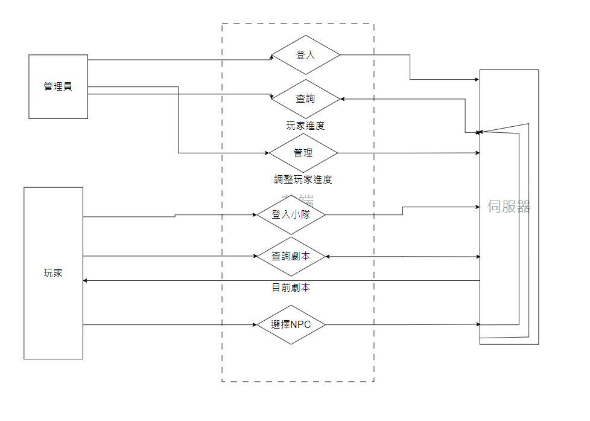

# ckcsc RPG網頁



## 目錄


````
│   README.md               說明書
│   __init__.py             初始化(全域變數)
│   app.py                  啟動
│   requirements.txt        環境要求
│   
└───static                  css/js
│   │  main.css              
│   │  getscript.js        show_script.html 中用於取得劇本(ajax)
│   │  schedule.js         control_schedule.html 中用於顯示目前各小隊進度與調整表單內容
│   │  showscript.js       show_script.html 中用於調整後端傳來的劇本格式
│ 
└───templates               html
│   │  home.html            登入系統的主頁
│   │  login.html           登入頁面
│   │  useerPage.html       登入系統登入後顯示的頁面
│   │  show_script.html     顯示劇本給player
│   │  choose_script.html   顯示劇本的主頁，用於選擇劇本
│   │  control_schedule.html用於供admin管理各小隊進度
│   │  rpg_script.html      沒用到，測試用
│   │  The_progress_of_each_group.html 尚未實現功能，顯示各組進度
│ 
└───RPGscript               存放RPG劇本
│   ...
│
└───markdown                README用圖片
│   ...
│
└───script_player           對player部分系統
│   │   scriptControlter.py 劇本調用系統
│   │   scriptsystem.py     與player有關的route
│   │   showscript.py       與顯示劇本相關function
│ 
└───admin                   與admin有關系統
│   │   adminsystem.py      與admin有關的route
│   │   progressController.py 管理各小隊進度
│   │   schedule.py         進度管理相館function(格式轉換)
│
└───login
│   │   loginsystem.py      與登入有關的route
│   │   user.py             與登入有關的function
│
````